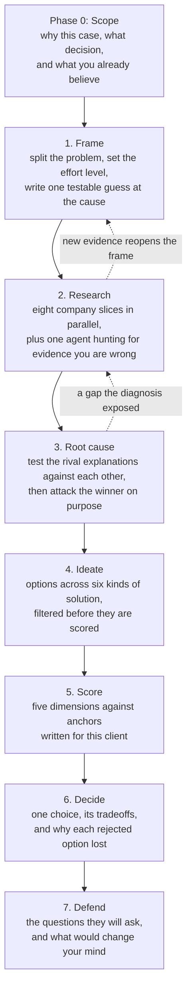

# case-research-pipeline

[](https://opensource.org/licenses/MIT)
[](https://claude.com/claude-code)

> A method for taking a company case study from a raw brief to a recommendation that holds up when a panel attacks it. Built for [Claude Code](https://claude.com/claude-code), using [Exa](https://exa.ai) for web research. The output is a company you actually understand, a diagnosis you can prove, one recommendation, and a written answer to every hard question you will be asked about it.

**Status: testing.** The method is written and internally complete. This particular merge has not yet been run end to end on a live case, which is the next thing that happens to it. Expect rules to move once a real case finds the holes. The stage spine comes out of real coursework; the evidence rules layered on top of it are newer and less worn in.

---

## Why it exists

Case work fails in four predictable ways, and every rule below exists to block one of them.

**People research everything and analyze nothing.** Two weeks of reading produces a pile of facts and no decision. The fix is that research must serve a decision, and every research thread has to name the question it answers before it is allowed to run.

**People solve the symptom.** The obvious solutions are obvious because they answer a shallow reading of the problem. The fix is not a creativity exercise. It is a harder diagnosis: push the cause deep enough and the tired solutions stop fitting, because they were aimed at something you have already ruled out.

**Research quietly confirms what you already believed.** You search for support, you find support, and you never look for the evidence that would prove you wrong. The fix is a dedicated skeptic in every research round, and a diagnosis method that ranks a cause by how little evidence contradicts it rather than by how much supports it.

**The work evaporates between sessions.** A chat ends, context is gone, and the next session re-derives half of what was already settled. The fix is a single state file, written to be read cold by someone with no memory of the work.

There is a fifth failure that is quieter and worse. The research looks fine, the prose reads well, and the conclusion is wrong, because a company brochure got treated as fact, a single unverified number got repeated until it looked confirmed, or two files contradicted each other for three weeks and nobody noticed. The honesty rules in `method/02-evidence-rules.md` are the guard rails for that one, and they were adapted from the source credited at the bottom of this file.

---

## What you bring, what you get back

| You bring | You get back |
|---|---|
| [Claude Code](https://claude.com/claude-code), CLI or desktop | A company profile split into eight parts, every load-bearing claim cited and confidence-tagged |
| The [Exa MCP server](https://docs.exa.ai) connected | A named root cause, with the rival explanations you killed and the evidence that killed them |
| A case brief, and the rubric or criteria you will be judged on | A scored shortlist of solutions, sorted into strong, contested and weak |
| A decision that has to be made, and a date | One recommendation with its tradeoffs, plus a written answer to every hostile question a panel is likely to ask |

Nothing here is autonomous. Sub-agents do the legwork. The judgment steps stay with you, and the method says exactly which ones those are.

---

## The pipeline at a glance



The stages are fixed. The path between them is not. You can loop back, go deep then shallow, or reopen the frame when research surprises you. What stays rigid is the gate at the end of each stage: to move forward, you clear the bar.

| Stage | What it produces | The bar you have to clear |
|---|---|---|
| 0. Scope | `00-state.md` | The decision is written in one sentence, with a date and your starting belief. |
| 1. Frame | `02-frame.md` | The problem statement survives the question "is that the symptom or the cause?" |
| 2. Research | `03-research/synthesis.md` | Every branch is covered, the skeptic found something real, and the citations were checked by someone who did not write them. |
| 3. Root cause | `04-root-cause/synthesis.md` | Two or more methods agree, the winner survived a genuine attack, and the causes you rejected are on record with the reason. |
| 4. Ideate | `05-solutions/candidates.md` | The options span several kinds of solution, not three flavours of one. |
| 5. Score | `05-solutions/scored-shortlist.md` | Every score points at a written standard, not a hunch. |
| 6. Decide | `06-decision.md` | One choice, its criteria, its tradeoffs, and why each alternative lost. |
| 7. Defend | `07-defense.md` | Every soft spot has a prepared answer, and you have named the evidence that would make you drop the recommendation. |

---

## What a finding actually looks like

An illustrative excerpt, with invented numbers:

```markdown
The company owns the buildings at 266 Vietnamese branches but owns no land
anywhere in the country [F/95%] ([asset register p.41](https://example.com/report)).
The earlier claim that it "owns nothing in Vietnam" is wrong on the client's
own filing and has been corrected everywhere it appeared.

Rent on the ground under those buildings is the likeliest home of the reported
loss, given the depreciation and lease-finance lines sit above it [I/70%].

CONFLICT surfaced: the annual report gives Thailand as 75 per cent of sales
([AR25 p.12](https://example.com/ar)) while the sustainability report gives
80 per cent on continuing operations ([SD25 p.14](https://example.com/sd));
both carried, resolved in favour of the continuing-operations figure.
```

Three things are happening in that excerpt, and they are the heart of the method.

**Every claim carries a tag.** `[F/95%]` is a fact checked against an original record. `[I/70%]` is your own reasoning from evidence. `[A/55%]` is an assumption that has to hold for your read to stand. The number is your confidence, and **you assign it yourself when you write the sentence.** An agent never assigns it, because agents report evidence and evidence is not yet judgment.

**Conflicts are shown, not tidied away.** When two sources disagree, both numbers and both sources go in the document. A document that reads too clean has usually laundered its contradictions.

**A wrong claim gets corrected everywhere, not patched in one file.** Which is why cross-file routing is a rule rather than a habit.

---

## The five rules that carry the whole system

1. **Research serves a decision, never the reverse.** Every research thread names the question or the guess it tests. No question, no thread. Unbounded reading is the enemy of good case work.

2. **No fact without a citation, no judgment without a tag.** If you cannot trace a claim to a source you can open, it is a lead, not a fact. If you cannot say whether you checked it, reasoned it, or assumed it, you do not yet know what you are claiming.

3. **Verify by trying to break it.** The verification step tries to refute a claim, not confirm it. A company's own page is proof of what it says about itself, and what is actually true is a separate and harder question.

4. **A sharper diagnosis is where differentiation comes from.** Not from a brainstorming module bolted on at the end. If the obvious solutions still look reasonable, the diagnosis has not gone deep enough yet.

5. **Every gate has a challenge you have to survive.** Before any stage is marked done, the strongest argument against your conclusion gets written down, along with the evidence that would change your mind. If a disagreement does not resolve, it goes on the record instead of disappearing. These are the exact places a panel probes, so tracking them is preparation, not paperwork.

---

## Plain-English glossary

The method uses a few named techniques. Here is what each one actually does, without the jargon.

**Issue tree, and the MECE test.** You split the problem into branches, the way you would break a big question into smaller ones. MECE is a two-part check on that split: the branches must not overlap, and together they must cover the whole problem. A split that double-counts sends two people to research the same thing. A split with a hole sends nobody to research the part that matters.

**Cynefin triage.** A quick call on what kind of problem you are facing, which then sets how hard the rest of the pipeline runs. If cause and effect are knowable and an expert could diagnose it, run light. If the system is tangled and things only make sense in hindsight, run heavy. If there are no stable patterns at all, stabilise the situation before researching anything. This is the throttle. Without it, every case runs at maximum effort, including the simple ones.

**Governing hypothesis.** One sentence saying what you think the real cause is, written so that it could be proven wrong. "Costs are too high" cannot be proven wrong and is useless. "The loss sits in ground rent, not in operating margin" can be checked. Its job is to give the research something to aim at. It is frozen for the length of one research round so the aim stays steady, and you may rewrite it between rounds when the evidence turns.

**Wave.** One round of research. Every wave declares its reason before it runs: build the baseline, fill a specific hole a later stage exposed, or refresh a topic because something changed. New findings get added to existing files, never written over the top of them. A wave stops when it comes back dry, meaning it turns up nothing new. Dry is the signal to stop, not a page count or a source quota.

**Two-axis source grading.** Every source gets two separate marks instead of one blended score. **Reliability** is about the source itself: a regulator's filing outranks a press release. **Credibility** is about the one specific claim you are taking from it: is it the original record, is it recent, does anything else confirm it. Two marks catch the two cases a single score hides, which are a trustworthy outlet making a weak claim, and a modest outlet reporting a solid original fact. One hard rule comes with it: **a source that is the sole origin of a number is capped low no matter how many outlets repeat it.** Ten articles quoting one survey is one source.

**F / I / A tag.** The three-way label on every load-bearing sentence, described in the excerpt above. Fact, inference, assumption, plus your confidence as a percentage. The point is not bookkeeping. The point is that writing `[A/50%]` forces you to notice you are standing on an assumption, at the moment you write the sentence rather than the night before the pitch.

**ACH, or analysis of competing hypotheses.** The core move of the diagnosis stage, and the least intuitive one. Normally you pick your favourite explanation and go looking for support. ACH does the opposite. You list every explanation still in play, you lay out the key pieces of evidence, and for each piece you ask which explanations it contradicts. **The winner is the explanation with the least evidence against it, not the one with the most evidence for it.** That reversal is the whole trick. An explanation can have plenty of support and still be dead if one fact flatly contradicts it, and the ordinary way of working never surfaces that fact. It also produces a by-product worth as much as the answer: a written record of every explanation you killed and exactly what killed it. When a panelist asks "but isn't the real problem X?", you are not guessing, you are reading.

**Positive control.** A rule about proving an absence. "We could not find it" is a statement about your search, not about the world. Before you publish an absence, show that your method finds things that are definitely there. "The company appears on no industry roster, and the rosters we checked do list its named competitors" is a finding. Without that second clause, it is a failed search waiting to embarrass you in the room.

**Marketed versus shipped.** Keep two layers apart: what a company says it does, and what it demonstrably does. The company's own materials are the best possible source for the first and a poor one for the second. Where the two layers disagree is very often the most useful thing you will find in the entire engagement.

**Solution archetypes.** Six different kinds of answer: technology, process, business model, partnership, behaviour, and rules or structure. The default failure at the ideas stage is generating three versions of the same idea, usually three technology ideas. Deliberately checking each of the six is what surfaces the option nobody at the client had considered.

**Cliché gate.** One question asked of every surviving idea: would a company this size already have thought of this, and if so, why has it not worked for them, or what makes ours different? An idea that cannot answer gets cut or sharpened until it can. This is the first question a panel asks, so answering it early is rehearsal. A common-looking play that has a sharp answer is completely fine. Being different is not the goal; having an answer is.

**Attack note.** Attached to every finalist solution: the strongest argument a hostile panel makes against it, its weakest dimension and the specific reason for that score, and what evidence would raise it. Every attack note written during scoring is a question you have already pre-empted by the time you are defending.

**Official file.** Each stage has exactly one file that counts. Drafts live underneath it in a `drafts/` folder. The next stage reads only the official file, and a stage is not done until you have read it yourself. It is called official rather than final on purpose: a later insight can change it, as long as the change gets logged.

---

## The eight company slices

The research stage does not invent a topic list per case. It runs a fixed decomposition, so that every fact has exactly one home and nothing quietly falls between two agents.

| # | Slice | The question it answers |
|---|---|---|
| 1 | **Bet** | What is the company betting on, why now, and what has to be true for that bet to work? |
| 2 | **Entity** | What is this thing? Ownership, history, legal structure, footprint, and where the money comes from and goes. |
| 3 | **Offer** | What does it actually sell, and how does that differ from what it markets? |
| 4 | **Customers** | Who buys, why, what are they really hiring it to do, and how many of them are there? |
| 5 | **Rivals** | Who else is in the ring, and where is this company exposed? |
| 6 | **Machine** | How does it physically run? Supply chain, network, assets, technology, the operational plumbing. |
| 7 | **Rules** | What regulation, licensing, tax and policy does the business sit inside? |
| 8 | **People** | Who runs it, who is being hired, and what does that pattern signal? |

Alongside those eight runs a ninth agent with no subject of its own. The **skeptic** exists only to find evidence that the governing hypothesis is wrong. It is what stops a research round from becoming an expensive way of agreeing with yourself. A skeptic that comes back with nothing is a warning sign, not a clean bill of health.

Two notes on using this map. Slices 6 and 7 matter enormously for an asset-heavy or regulated business and barely at all for a small software company, so the Cynefin call from framing decides which slices get a deep cut and which get a single pass. And each slice declares what it owns and what its neighbours own, so that when an agent researching Rivals turns up a fact about Rules, it gets routed there instead of sitting in the wrong file where nobody will find it.

The **people** slice has a hard boundary: public professional signal only. The public org chart, hiring patterns and what they suggest, published talks, stated career history. Not private life, not guessed-at psychology, nothing that reads as surveillance rather than research. The test is simple. If the person read this file, would it look like serious professional work, or would it make them uncomfortable? Research that fails that test damages the relationship it was meant to serve.

---

## What is inside

The method is ten documents. The templates are the shapes it produces. Everything else is an entry point into one of those two.

| Part | File | What it covers |
|---|---|---|
| Entry point | `AGENTS.md` | What this repo is, which file to read depending on why you are here, and the rules for editing it. `CLAUDE.md` imports it rather than keeping a second copy. |
| Entry point | `SKILL.md` | What to read at each stage, tool routing, and which steps never get delegated. |
| Entry point | `CONTRIBUTING.md` | The branch model, what a pull request has to explain, and how two people compare competing approaches. |
| Command | `.claude/commands/case-research.md` | `/case-research <company>`, which checks the setup, resumes or starts a case, and walks the stages. |
| Method | `method/01-spine.md` | The stages, the gates, the state file, and the official-file rule. |
| Method | `method/02-evidence-rules.md` | The F/I/A tags, two-axis source grading, and the twelve honesty rules. |
| Method | `method/03-company-map.md` | The eight slices, their ownership boundaries, and cross-slice routing. |
| Method | `method/04-framing.md` | Scout sweep, issue tree, the Cynefin throttle, the governing hypothesis. |
| Method | `method/05-research.md` | Waves, parallel agents, the skeptic, citation verification. |
| Method | `method/06-root-cause.md` | Diagnostic lenses, ACH, the contrarian pass. |
| Method | `method/07-ideation.md` | The six archetypes, the relevance gate, the cliché gate. |
| Method | `method/08-scoring.md` | The scoring rubric, tuned anchors, reading results as bands. |
| Method | `method/09-defense.md` | Harvesting soft spots, hostile questions, what would change your mind. |
| Method | `method/10-tools.md` | Connecting Exa, the parameter defaults that quietly ruin research, and cost. |
| Template | `templates/state.md` | The state file: the spine a cold session reads first. |
| Template | `templates/dossier.md` | A company slice, with its ownership header and tag legend. |
| Template | `templates/gather-report.md` | What a research agent hands back. |
| Template | `templates/verification-report.md` | Per-claim verdicts from the verification pass. |

---

## Setup

**Connect Exa first.** The research stage does not work without it, and the failure is not obvious: an agent with no search tool will still produce confident prose.

```bash
claude plugin install exa@claude-plugins-official
```

Or, for the MCP server alone:

```bash
claude mcp add --transport http exa https://mcp.exa.ai/mcp
```

Restart Claude Code, then check that `mcp__exa__web_search_exa` and `mcp__exa__web_fetch_exa` are available. The hosted server works anonymously with rate limits; a `429` means you need your own key. Setup detail, the parameter defaults that matter, and the cost levers are in `method/10-tools.md`.

Read that file before your first research stage. One default in it, a 3,000 character cap on page fetches, will silently reduce a full annual report to its opening page and give you no indication it happened.

## Quickstart

There are two install modes, and picking the wrong one is the usual reason nothing works.

**To use the method on cases in other projects**, clone into the Claude Code skills directory:

```bash
git clone https://github.com/BiiBii04/case-research-pipeline.git \
  ~/.claude/skills/case-research-pipeline
```

The skill then loads on its own whenever a case-shaped request appears, in any project, so you never have to name it:

```
I have a case study on Acme Corp, brief and rubric attached. Run the case pipeline.
```

**To work on the method itself**, clone anywhere and open Claude Code inside it:

```bash
git clone https://github.com/BiiBii04/case-research-pipeline.git
cd case-research-pipeline
claude
```

That mode gives you `AGENTS.md` and the `/case-research` command:

```
/case-research Acme Corp
```

The command checks that Exa is connected, resumes an existing case or sets up a new one, and walks the stages. Project commands only load from the directory Claude Code was opened in, which is why the command exists in this mode and not the other.

Either way, expect one heavy stage per session. Work written at the tail end of a long session degrades in ways you can measure afterwards.

Expect one stage per session for the heavy ones. A document written at the tail end of a long session degrades in ways you can measure: tags get sloppy, contradictions get resolved instead of surfaced, and the routing step gets skipped. If a session runs long, stop before the writing step and write fresh.

---

## Design decisions

| Decision | Why | What it costs |
|---|---|---|
| Fixed stages, free movement between them | Case work is genuinely iterative, and a rigid conveyor belt makes people fake progress to satisfy it. Rigid gates with a flexible path gives the discipline without the theatre | You need the state file to stay current, or looping back loses the thread |
| Effort is throttled by the Cynefin call, not by default | Running the full machinery on a simple problem burns a week and produces no more insight than a day would have | You have to make a judgment call early, on thin evidence |
| You assign every tag when you write, agents never do | Agents report evidence, and evidence is not judgment. Adjudication is the step that makes the document defensible | The writing step cannot be delegated |
| A dedicated skeptic agent in every research round | Left alone, research becomes an expensive confirmation of what you already thought | One extra agent per round, and sometimes it destroys work you liked |
| The winner is the explanation with the least evidence against it | Support is easy to find for any story. Contradiction is what discriminates | ACH is slow, and on a simple case it is overkill |
| Differentiation is weighted lightly in scoring | So that being clever can break a tie but can never rescue a weak option | Genuinely novel ideas can lose to safe ones, which is usually correct and occasionally not |
| Rejected options are documented, always | "Did you consider X?" becomes "yes, here is its score and the dimension it failed on" | Writing up things you are not doing feels like waste until the moment it saves you |
| One state file, written for a reader with no memory | Sessions end. Context dies. The alternative is re-deriving settled work every time | It only works if you actually update it at the end of every session |

---

## Cost and limitations

Exa bills by usage, and the spend is driven by crawl discipline rather than case size. Reading full sources deeply is the expensive part and also the point, so the lever is choosing what to read in full, not reading everything shallowly.

Limits worth knowing before you start:

- Where Exa's index is thin, there is no second search engine here to fall back on.
- A full case runs several sessions by design. It is not a one-sitting method.
- The output quality tracks how honestly you run the judgment steps. The pipeline structures the work; it does not do the thinking.
- ACH and the full skeptic treatment are overkill on a simple, well-understood problem. That is what the Cynefin throttle is for, and skipping the throttle is the most common way to waste a week.
- It assumes a case with a client and a decision. It is not built for pure market research or for open-ended curiosity.

---

## What this is not

- **Not autonomous research.** The diagnosis, the tags, the attack, and the writing stay with you. Agents do legwork.
- **Not a summariser.** A summary of what a company says about itself is the thing this method is built to distrust.
- **Not a deck generator.** The output is reasoning you can defend. Turning it into slides is a separate job.
- **Not a way to skip the reading.** Every rule here assumes you read the sources that carry your argument.

---

## FAQ

**Do I have to run all seven stages?** No, but skipping is a decision to make out loud. The two that are almost never worth skipping are the frame and the root cause, because everything downstream inherits them. A lazy frame poisons the whole case.

**What if I already did the research before the brief arrived?** Common in coursework, where you research the client for weeks and the actual problem lands three days before the pitch. Run Phase 0 and the research stage first, then frame when the brief lands, then use the frame to decide which slices need a top-up round. The research you already did is not wasted; it just has to be re-read against the real question.

**Why eight company slices instead of one research file?** A company is too large to research as a single question. Splitting it gives every fact exactly one home, which is what makes contradictions findable. Two files claiming the same fact is a structural bug, and you want to be able to see it.

**Is the scoring an average I can just read off?** No, and treating it as one is a mistake the method warns about twice. Sort the options into strong, contested and weak, and use the number only to separate options inside the strong band. The written justification carries the decision. The arithmetic just organises it.

**Can I swap Exa for something else?** The method transfers. The tool instructions do not, because they are written against one tool's verified behaviour. Swapping means rewriting that part against your own observations.

---

## Repository structure

```
.
├── .claude/commands/    # /case-research, the executable entry point
├── method/              # The method: ten documents
├── templates/           # Output shapes: state, dossier, gather report, verification report
├── cases/               # Your working folders land here, one per case (gitignored)
├── AGENTS.md            # Agent entry point, the single source of agent instructions
├── CLAUDE.md            # Imports AGENTS.md, not a second copy
├── CONTRIBUTING.md      # Branch model, review, house style
├── SKILL.md             # Claude Code skill definition and stage routing
├── LICENSE              # MIT, plus the upstream notice for the adapted parts
└── README.md            # This file
```

Nothing in `cases/` is ever committed. This repo holds the method, not the work done with it.

---

## Credits

The diagnosis, scoring and defence half of this pipeline is original work, grown out of running real case assignments and losing arguments in real panels.

The honesty half is adapted, with thanks, from [thangnguyenworkspace/company-research-pipeline](https://github.com/thangnguyenworkspace/company-research-pipeline), released under MIT. Four ideas came across more or less intact: the F/I/A confidence tag assigned by a human at write time, the two-axis source grade with a hard cap for single-origin numbers, the ban on publishing an absence without a positive control, and the practice of giving each research slice a written ownership boundary so cross-findings get routed instead of lost. That repository is the better tool if what you need is to understand a company to diligence depth and no decision follows. This one is for when a decision does.

The analytical vocabulary behind ACH and two-axis grading comes from the intelligence-analysis tradition, principally Richards J. Heuer Jr's *Psychology of Intelligence Analysis*, which is free to read and worth the afternoon.

---

## License

MIT. Use it, fork it, adapt it.
